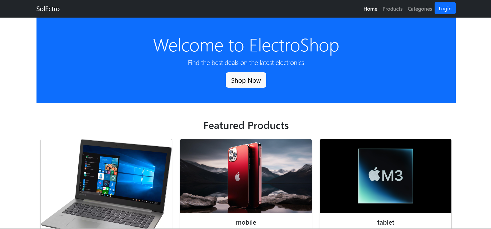

# Project: SolEctro - Electronics Store

## Screenshot



## Description

SolEctro is an e-commerce platform for electronics, offering a wide range of products including laptops, smartphones, tablets, and accessories. The platform features user authentication, product browsing, categories, and a shopping cart functionality.

## Features

- Modern Bootstrap-based UI
- Featured products section on the homepage
- Dynamic product details page
- Categories for better organization
- User authentication (login/logout)
- Shopping cart functionality

## Installation

1. Clone the repository:
   ```sh
   git clone https://github.com/your-username/solEctro.git
   cd solEctro
   ```
2. Create a virtual environment and activate it:
   ```sh
   python -m venv venv
   source venv/bin/activate  # On Windows use `venv\Scripts\activate`
   ```
3. Install dependencies:
   ```sh
   pip install -r requirements.txt
   ```
4. Run the development server:
   ```sh
   python manage.py runserver
   ```

## Usage

- Browse products and categories
- View product details
- Add products to the cart
- Checkout (Feature coming soon)

## Technologies Used

- **Backend:** Django, Python
- **Frontend:** HTML, CSS, Bootstrap
- **Database:** SQLite (default, can be changed)

## Contributing

Pull requests are welcome. Please open an issue first to discuss any major changes.

##
